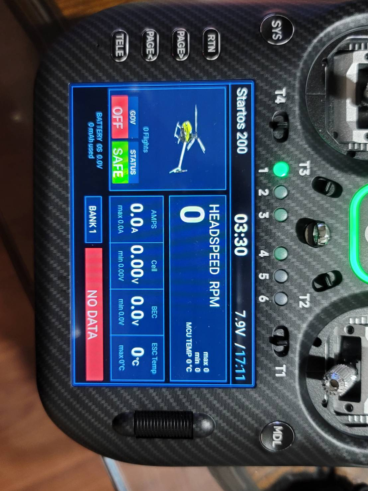

# RBCT Helicopter Dashboard Widget

**Author / 作者**: 雷恩 / Ryan Kuo

(English below)

**RBCT** 是一個專為 EdgeTX 開發的直昇機儀表板小工具 (Widget)，支援多種螢幕解析度自動適應，完美適配 RadioMaster TX16S MK3 (800x480)、TX16S MKII (480x272) 以及 TX15 MAX (480x320) 等全彩觸控螢幕。提供完整、直覺的飛行數據監控介面。

## 🌟 核心功能

*   **跨機種解析度自適應**：自動偵測螢幕大小，無論是 800x480 或 480 寬度的螢幕，皆能自動調整字體與圖片比例，維持最佳顯示效果。

*   **即時遙測數據顯示**：監控並顯示包含電池總電壓 (Vbat)、電流 (A)、消耗容量 (mAh)、BEC 電壓、單節最低電壓 (Cell) 以及 ESC / MCU 溫度。
*   **旋翼轉速監控 (Headspeed)**：即時顯示目前轉速 (RPM)，並記錄飛行過程中的最高 (max) 與最低 (min) 轉速。
*   **定速狀態指示 (Governor)**：提供醒目直覺的定速開啟/關閉 (ON/OFF) 狀態圖示。
*   **FBL 停懸段數 (Banks)**：根據您設定的遙控器開關或通道，動態顯示當前使用的 FBL 停懸段數 (Bank)。
*   **自訂儀表板主題色**：內建 7 種高對比主題色彩 (紅、橘、黃、綠、藍、靛、紫)，可依個人喜好自由切換。
*   **實體方向桿光圈控制**：直接在小工具中同步控制支援此功能的遙控器 (如 TX16S MK3) 方向桿 RGB 光圈，支援 7 種顏色與關閉選項。
*   **動態模型圖片**：自動讀取位於 `/IMAGES` 或 `/WIDGETS/RBCT/modelImage/` 的模型圖片。若無圖片則自動載入預設圖。
*   **飛行計時器整合**：於儀表板顯眼處同步顯示所選的遙控器計時器。

## 📥 安裝說明

1. 下載並將 `RBCT` 資料夾完整複製到遙控器 SD 卡內的 `WIDGETS` 目錄下 (路徑為 `/WIDGETS/RBCT`)。
2. 在遙控器上進入 Telemetry (遙測) 畫面設定。
3. 新增一個全螢幕 (Full screen) 區塊，並選擇 `RBCT` 小工具。

## ⚙️ 設定選項

在小工具設定選單中，您可以自訂以下項目：
*   **Timer (計時器)**：選擇要在畫面上顯示哪一個計時器 (Timer 1~3)。
*   **Bank Source (段數來源)**：選擇用來控制 FBL Bank 切換的通道 (Channel) 或開關。
*   **Arm Source (解鎖來源)**：選擇對應您遙控器上解鎖 (ARM) 功能的開關或通道，讓畫面能準確同步顯示。
*   **Banks (段數數量)**：設定可用的 Bank 總數 (2 至 6 段)。
*   **Theme (主題)**：選擇您喜歡的面板顏色。
*   **LED Color (光圈顏色)**：設定遙控器實體方向桿光圈的顏色 (7色可選或 OFF)。

## 🚁 模型圖片設定

若要自訂儀表板上的直昇機圖片：
*   請準備 `.png` 格式的去背圖片。
*   將圖片放入 `/WIDGETS/RBCT/modelImage/` 目錄，並將檔名命名為與「模型名稱」完全一致。
*   或者直接透過 EdgeTX 系統內建的模型圖片設定，小工具也會自動抓取顯示。

---

## 🇬🇧 English Description

**RBCT** is a comprehensive and visually rich helicopter dashboard widget for EdgeTX. It features dynamic resolution scaling, perfectly supporting the RadioMaster TX16S MK3 (800x480), TX16S MKII (480x272), and TX15 MAX (480x320) color displays. 

### Features

*   **Dynamic Resolution Scaling**: Automatically adapts layout, font sizes, and image scaling for different screens, ensuring a perfect fit across multiple radio models.
*   **Real-Time Telemetry Display**: Monitors and displays critical flight data including Battery Voltage, Current (Amps), Capacity (mAh), BEC Voltage, Lowest Cell Voltage, and ESC/MCU Temperatures.
*   **Headspeed Tracking**: Displays current Headspeed (RPM) along with maximum and minimum RPM statistics during the flight.
*   **Governor Status**: Clear visual indicator for Governor ON/OFF state.
*   **FBL Bank Switching**: Dynamically displays the current FBL (Flybarless) Bank number based on your switch configuration.
*   **Customizable Themes**: Choose from 7 built-in color themes (Red, Orange, Yellow, Green, Blue, Indigo, Violet) to match your preference.
*   **Physical Gimbal LED Control**: Directly control the physical RGB gimbal rings on supported radios (like TX16S MK3) from the widget, with 7 color options or OFF.
*   **Dynamic Model Images**: Automatically loads model pictures from `/IMAGES` or `/WIDGETS/RBCT/modelImage/`. Falls back to a default image if no specific image is found.
*   **Timer Integration**: Displays your selected flight timer prominently on the dashboard.

### Installation
1. Copy the `RBCT` folder into the `WIDGETS` directory on your SD card (`/WIDGETS/RBCT`).
2. On your radio, navigate to the Telemetry screen setup.
3. Select the `RBCT` widget and assign it to a full-screen layout.
